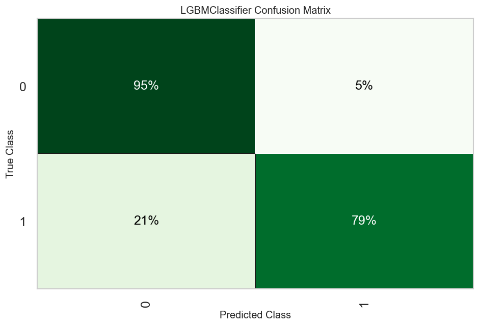
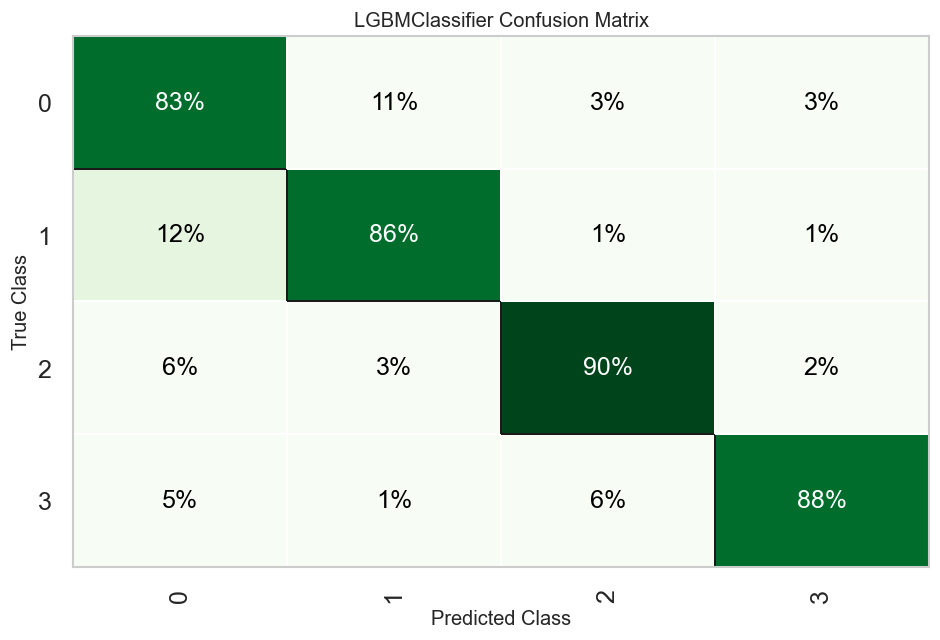
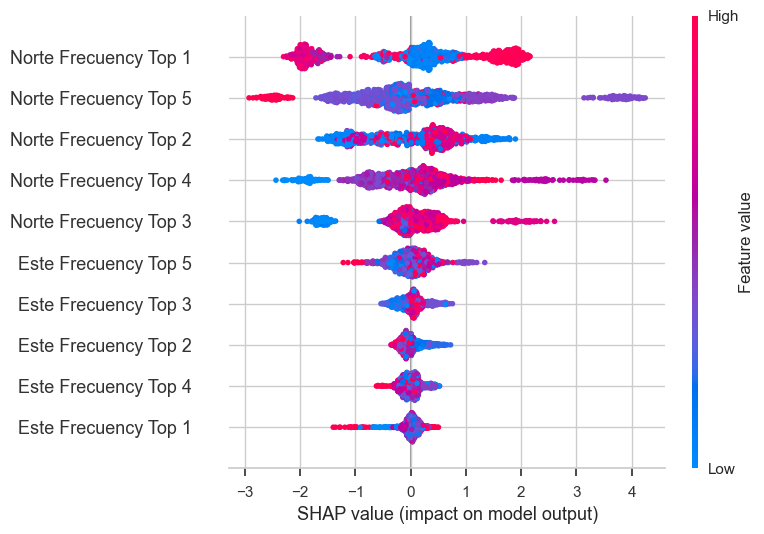

# Wind Turbine Structural Damage Detection with Machine Learning


Vibration-based **detection and localization of structural damage** on a real 14-meter
prototype wind turbine, using accelerometer signals, modal analysis and machine
learning. Built as part of my M.Sc. thesis within a structural health monitoring (SHM)
research project at **EIA University (Medellín, Colombia)**.

- **Real hardware, real data** — 6,888 vibration records collected over a 1.5-year
  experimental campaign on an instrumented turbine mast in East Antioquia, Colombia.
- **Physically induced damage** — stiffness loss was created by manipulating the
  tension of the guy wires that support the mast, producing 12 distinct damage
  scenarios plus healthy baselines.
- **Physics-informed features** — damage shifts the structure's natural frequencies
  (the first mode moves from ≈0.68 Hz healthy to ≈0.39 Hz damaged), so the models are
  trained on modal frequencies extracted with Frequency Domain Decomposition rather
  than on raw signals.

## Results

Two supervised tasks, five algorithm families, identical training protocol
(stratified 80/20 split, stratified 10-fold CV, random-search tuning, fixed seed).
All numbers below are **hold-out** metrics reproduced from the executed notebook.

**Task 1 — Damage detection (binary: healthy / damaged)**

| Algorithm | Accuracy | AUC | Recall | Precision | F1 |
|---|---|---|---|---|---|
| Random Forest | **0.917** | 0.964 | 0.917 | 0.916 | 0.917 |
| LightGBM | 0.914 | **0.973** | 0.914 | 0.912 | 0.913 |
| Gradient Boosting | 0.908 | 0.966 | 0.908 | 0.907 | 0.907 |
| KNN | 0.793 | 0.832 | 0.793 | 0.775 | 0.765 |
| SVM (linear) | 0.750 | — | 0.750 | 0.563 | 0.643 |

**Task 2 — Damage localization (multiclass: healthy / top / bottom / top-bottom)**

| Algorithm | Accuracy | AUC | Recall | Precision | F1 |
|---|---|---|---|---|---|
| LightGBM | **0.867** | **0.974** | 0.867 | 0.869 | 0.867 |
| Gradient Boosting | 0.861 | 0.969 | 0.861 | 0.864 | 0.862 |
| Random Forest | 0.835 | 0.957 | 0.835 | 0.838 | 0.835 |
| KNN | 0.576 | 0.828 | 0.576 | 0.594 | 0.575 |
| SVM (linear) | 0.388 | — | 0.388 | 0.522 | 0.345 |

<p align="center">
  
  
  <br>
  <em>LightGBM hold-out confusion matrices — damage detection (left) and localization (right).</em>
</p>

Tree ensembles clearly dominate: the decision boundaries between damage states in
modal-frequency space are non-linear, which is exactly where a linear SVM collapses to
majority-class behaviour (Kappa = 0) and boosted trees shine. This notebook is the
**baseline** of the thesis methodology, and every number above is reproduced directly
from its preserved outputs.

## How it works

```
raw accelerometry (6 channels @ 1 kHz, TDMS/LVM)
   │  tare subtraction → detrend → Hann smoothing → Butterworth band-pass (0–30 Hz)
   │  → resample to 100 Hz → detrend
   ▼
Frequency Domain Decomposition (per record)
   │  cross-spectral density matrices between same-axis sensors
   │  → SVD at every frequency line → first singular value spectrum
   │  → peak picking: top-5 natural frequencies × 2 axes = 10 features
   ▼
data preparation
   │  class balancing across 14 campaigns → 6,888 records
   │  IQR outlier replacement (per damage scenario, median imputation)
   ▼
AutoML training (PyCaret)
   │  SVM · KNN · Random Forest · Gradient Boosting · LightGBM
   │  stratified 10-fold CV → random-search tuning → hold-out evaluation
   ▼
deployable pipelines (preprocessing + model, pickled) + SHAP interpretability
```

The full implementation, with every metric table, confusion matrix, feature-importance
plot and SHAP analysis preserved from the original training runs, is in
[`wind_turbine_fdd_ml_pipeline.ipynb`](wind_turbine_fdd_ml_pipeline.ipynb):

| Section | Contents |
|---|---|
| 1–3 | Project intro, campaign labeling, signal-processing configuration |
| 4 | Signal preprocessing & FDD feature extraction (runs on the private raw data) |
| 5 | Data import, outlier treatment, dataset assembly |
| 6.1 | Binary damage detection — 5 models, tuning, evaluation, deployment |
| 6.2 | Multiclass damage localization — 5 models, tuning, evaluation, deployment |

## Interpretability

<p align="center">
  
  <br>
  <em>SHAP summary for the LightGBM detector: low first-mode frequencies push predictions toward "damaged" — matching the physics (stiffness loss lowers natural frequencies).</em>
</p>

SHAP values (tree models) and permutation feature importance (others) confirm the
models rely on the physically meaningful features — chiefly the lowest natural
frequencies — rather than on artifacts, which is what makes the approach credible for
a monitoring system that must generalize to unseen damage configurations.

## Data availability

The accelerometry dataset (6,888 records, 14 acquisition campaigns) was collected under
a research project at EIA University and **is not publicly available**. The notebook
preserves all executed outputs — score grids, hold-out metrics, confusion matrices and
interpretability plots — so the entire pipeline can be reviewed without access to the
raw data. No raw signals are included in this repository, and previews of derived
features are limited to standard truncated table headers.

## Reproducibility notes

- Fixed `session_id` throughout: every split, fold and search is deterministic.
- Normalization and imputation live **inside** the PyCaret pipeline, fitted on the
  training split only — no leakage from the hold-out set.
- Training used GPU acceleration (LightGBM OpenCL) where supported.
- **Stack:** PyCaret 3 orchestrates **scikit-learn** estimators and pipelines under the
  hood (SVM, KNN, Random Forest and Gradient Boosting are scikit-learn models;
  LightGBM plugs in through its scikit-learn API). Signal processing is **SciPy**
  (filtering, resampling, CSD, SVD), data handling is **pandas/NumPy**, plots are
  **Matplotlib/seaborn**, interpretability is **SHAP**, and raw acquisition files are
  read with **npTDMS**.
- Dependencies: [`requirements.txt`](requirements.txt) (Python 3.9–3.11 for PyCaret 3).
- Labels and figure text mix English and Spanish because the acquisition system was
  configured in Spanish; the notebook header includes a glossary.

## Author

**Alexey David Velásquez Betancurt** — M.Sc. in Engineering.
Thesis: machine-learning-based damage diagnosis methodology for wind turbines,
EIA University, Medellín, Colombia.

GitHub: [@Alexey0424](https://github.com/Alexey0424)

Licensed under the [MIT License](LICENSE).
